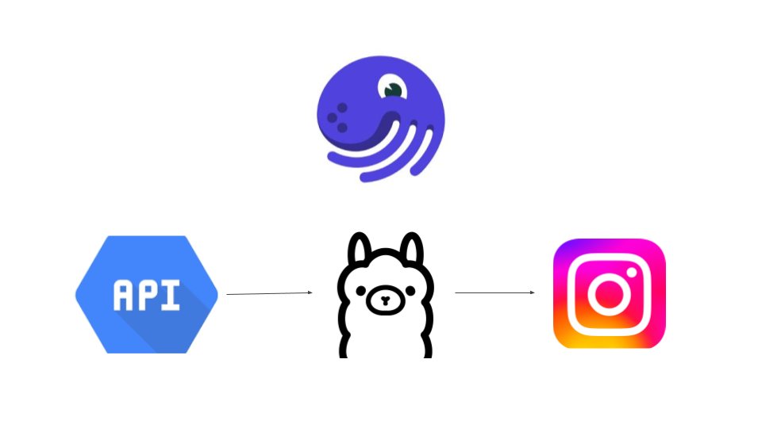

# Auto Post Project

## Overview

**Auto Post Project** is an automated workflow designed to gather the latest space news, summarize it, and generate Instagram posts. The project leverages **Dagster** as the orchestrator, uses a space news API for content, and integrates with the **LLaMA 3.1** language model through **Ollama** to synthesize news into Instagram slides. The workflow culminates in generating images with content for the posts and automatically publishing them to an Instagram account called `auto.post.project`.

## Features

- **Automated News Collection:** Retrieves the latest space-related news articles using a dedicated API.
- **Intelligent Summarization:** Utilizes the LLaMA 3.1 language model to generate concise and engaging summaries suitable for Instagram slides.
- **Slide Generation:** Automatically creates Instagram slides with summarized content, ready for posting.
- **Image Creation:** Generates images based on the content, which are then used in the Instagram posts.
- **Automated Posting:** Posts the generated content directly to the `auto.post.project` Instagram account.

## Workflow

1. **Dagster Orchestration:**  
   - Manages and schedules the entire workflow.
   - Ensures that the news collection, summarization, slide generation, and posting are performed seamlessly.

2. **News API Integration:**  
   - Fetches the latest space news articles from a reliable API.
   
3. **Content Summarization with LLaMA 3.1:**  
   - Summarizes the news articles using the LLaMA 3.1 model via Ollama.
   - The summarized text is optimized for Instagram slides.

4. **Image Generation:**  
   - Converts the summarized content into visually appealing slides.
   
5. **Automated Posting:**  
   - Publishes the slides and generated images to the `auto.post.project` Instagram account.

## License

This project is licensed under the MIT License - see the LICENSE file for details.
